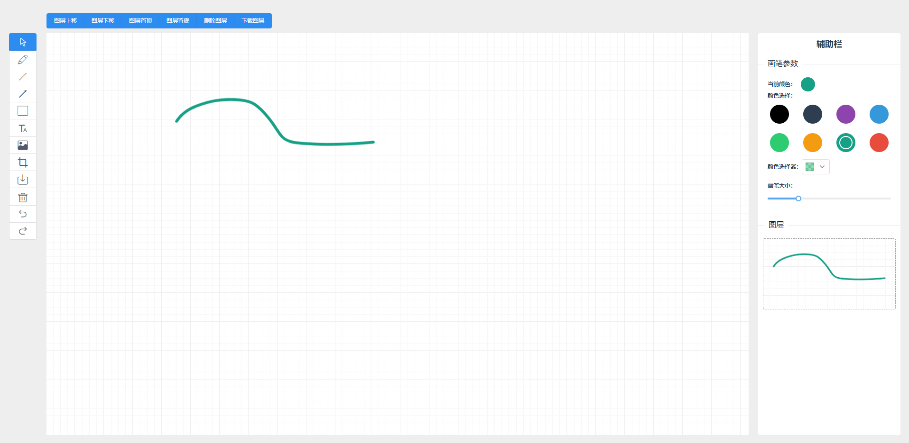

# vue-fabric

## 使用fabric.js重写的画板

项目演示: [预览地址](https://curtaintan.github.io/fabric-board/dist/#/)

样图：

## 感悟

    这个项目从开始构想，到大体完成只花了两天，
    后面在完善获取图层组，然后将图层组单独拿出来渲染到右侧的小canvas上的时候，出现了问题，

    断断续续的写了下，还是没有解决。

    算了吧，就这样吧

---

总的感觉fabric.js还是很强大的，就是文档有点糟心，一个对象提供的api没有用列表目录列出来，而是一整页的从上到下的挨个列出来，加上解释，好大一页，翻着头都大了------

## 后记

如果你要用fabric.js写项目的话，暂时就不要参考我这个项目了，
感觉写的不是很好，因为写这个项目中间断了一段时间，

加油

### 共勉！！

## 参考

- [drawingboard](https://github.com/vipstone/drawingboard)

参考了部分代码，这个画板的功能也没有写全

- [fabric.js操作教程](http://www.321332211.com/thread?topicId=243)

这一系列文章还不错，讲述了很多api和相应的坑，值得参考

- [Fabric.js中文教程](https://github.com/Rookie-Birds/Fabric-Tutorial_zh-CN)

中文的教程，不过比较老了，入门可以，要深入了解api还得看官方文档

- [fabric.js官方文档](http://fabricjs.com/docs/)

官方文档，不同对象的各种api的参数和用法都来这里查，这里是最新的。
